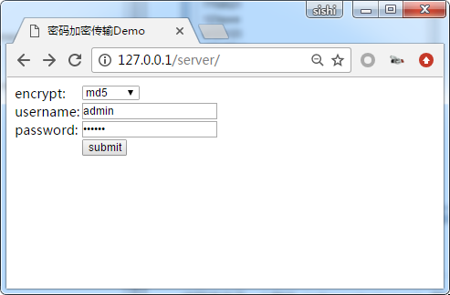
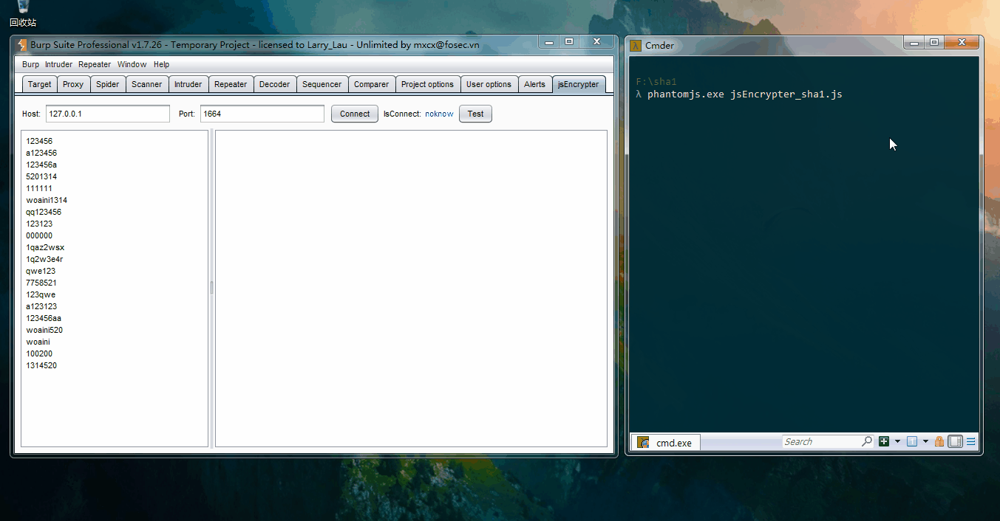
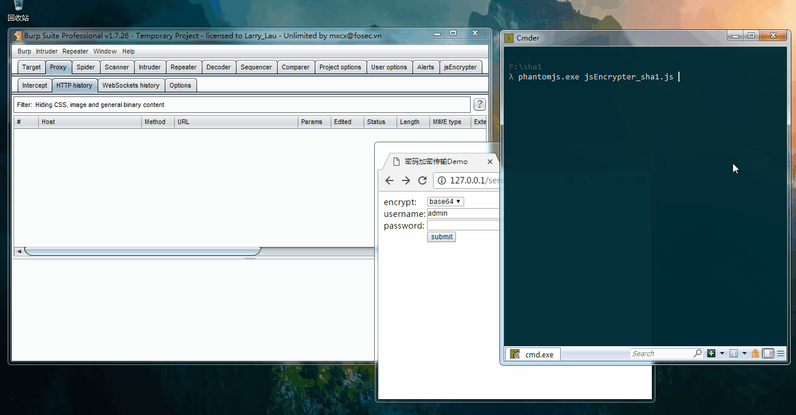

<h1 align="center">jsEncrypter | 前端加密Fuzz插件</h1>

<p align="center">
  
  
  
</p>


## 0x01 插件简介

本插件使用`phantomjs`启动前端加密函数对数据进行加密，方便对加密数据输入点进行fuzz，比如可以使用于前端加密传输爆破等场景。


## 0x02 插件编译

安装好maven，然后执行以下命令即可编译成功：

```
mvn package
```

## 0x03 插件使用
#### 3.1 运行靶机
项目提供了一个用php编写的靶机（jsEncrypter/server）,靶机提供了7个算法对密码进行加密后传输，后台解密，最后进行密码匹配。

* base64
* md5
* sha1
* sha254
* sha384
* sha512
* RSA



#### 3.2 编写phantomJS运行脚本

`jsEncrypter/js/jsEncrypter_base.js`为插件phantomJS脚本模板。我们只需要将实现加密算法的js文件引入模板脚本，并在模板脚本的js_encrypt函数体中完成对加密函数的调用。

````
...
/* 1.在这引入实现加密所有js文件,注意引入顺序和网页一致 */
loadScript("script-1.js");
loadScript("script-2.js");
loadScript("script-n.js");
/**********************************************/

...

function jsEncrypt(burp_payload){
	var new_payload;
	/* 2.在这里编写调用加密函数进行加密的代码,并把结果赋值给new_payload */

	/*********************************************************/
	return new_payload;
}
...
````

项目jsEncrypter/server/TestScript目录下是编写好的对应靶机各个加密算法的phantomJS脚本，可以参考！

#### 3.3 运行phantomJS并测试
运行phantomJS

```
>phantomJS.exe jsEncrypter_sha1.js 
```

测试的目的是为了确保我们编写的phantomJS脚本能够正常加密payload。



#### 3.4 抓包暴力破解


## 0x04 相关文章
* [编写加密传输爆破插件jsEncrypter](http://gv7.me/articles/2017/jsEncrypter/)
* [快速定位前端加密方法](http://gv7.me/articles/2018/fast-locate-the-front-end-encryption-method/)
* [解决jsEncrypter脚本错误代码不报错问题](http://gv7.me/articles/2018/solve-jsEncrypter-script-error-code-is-not-wrong/)
* [jsEncrypter的Node.js版server脚本](http://gv7.me/articles/2018/jsEncrypter-nodejs-server-script/)